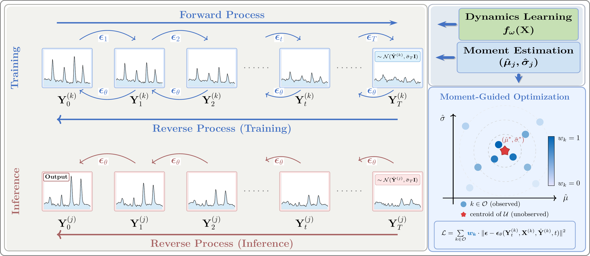

# ZeroDiff: Zero-Shot Time Series Reconstruction via Informed-Prior Diffusion

**[ICML 2026]**

Time series modeling critically depends on the availability of target observations. Yet in practice, such observations are often entirely absent for a significant portion of domains -- while exogenous variables may be accessible everywhere, target measurements remain unavailable due to cost, infrastructure, or other constraints. This creates a challenging generalization problem: can models learn from domains with complete observations to reconstruct targets for domains where they have never been observed?

We term this **zero-shot cross-domain time series reconstruction**, a task fundamentally different from conventional forecasting or imputation, as the model must infer temporal patterns for targets it has never seen during training.

**ZeroDiff** addresses this by combining (1) cross-modal moment estimation via a conditional VAE, (2) dynamics learning in a normalized space, and (3) diffusion-based calibration with an informed prior, enabling probabilistic reconstruction in a truly zero-shot setting.

## Framework

<div align="center">
    
</div>
<p align="center"><em>The informed prior combines moment estimation (VAE) with dynamics learning. The diffusion process starts from N(Ŷ, σ̄<sub>T</sub>I) rather than pure noise, enabling calibration instead of generation. Estimated moments also guide optimization by weighting training locations based on their proximity to the target in moment space.</em></p>

ZeroDiff operates in two stages:

1. **Informed Prior Construction**: Estimate target distribution statistics (&mu;, &sigma;) from exogenous inputs via a conditional VAE, then learn shared temporal dynamics in normalized space using an LSTM. This yields a coarse but structured reconstruction at both observed and unobserved locations.

2. **Diffusion-Based Calibration**: Apply a non-stationary diffusion process that learns to correct systematic errors in the prior. The forward process starts from the informed prior (not pure noise), and a moment-guided weighting scheme focuses training on locations most relevant to the target. A bidirectional denoiser leverages full temporal context for refinement.

## Results

NSE comparison across four datasets (higher is better). &dagger; denotes NSE < 0 (cross-location transfer failed).

**Diffusion Baselines.** Each baseline is evaluated standalone and with our dynamics learning module (+ f_&omega;) as informed input.

| Model | Streamflow | Solar | Temp | Methane |
|:------|:----------:|:-----:|:----:|:-------:|
| CSDI | &dagger; | 0.019 | &dagger; | &dagger; |
| CSDI + f_&omega; | 0.060 | 0.307 | 0.722 | &dagger; |
| SSSD | &dagger; | 0.446 | 0.605 | &dagger; |
| SSSD + f_&omega; | 0.071 | 0.374 | 0.746 | &dagger; |
| CSBI | &dagger; | 0.449 | 0.243 | &dagger; |
| CSBI + f_&omega; | 0.084 | 0.402 | 0.725 | &dagger; |
| DiffusionTS | &dagger; | 0.026 | 0.293 | &dagger; |
| DiffusionTS + f_&omega; | 0.033 | 0.259 | 0.747 | &dagger; |
| NsDiff | &dagger; | 0.515 | 0.700 | &dagger; |
| NsDiff + f_&omega; | 0.105 | 0.473 | 0.763 | &dagger; |

**Ablation Study.** We progressively add each component of ZeroDiff to show its contribution.

| Variant | Streamflow | Solar | Temp | Methane | Description |
|:--------|:----------:|:-----:|:----:|:-------:|:------------|
| f_&omega; | 0.131 | 0.345 | 0.813 | &dagger; | Dynamics learning only (LSTM) |
| &Phi;_&psi;,&omega; | 0.481 | 0.486 | 0.852 | 0.481 | + Moment estimation (VAE) |
| w/o prior | &dagger; | 0.323 | 0.829 | &dagger; | Diffusion from pure noise (no informed prior) |
| w/o bidir. & w_k | 0.365 | 0.518 | 0.860 | 0.671 | + Informed prior |
| w/o bidir. | 0.463 | 0.519 | 0.859 | 0.623 | + Moment-guided weighting |
| **ZeroDiff** | **0.596** | **0.846** | **0.868** | **0.788** | **+ Bidirectional denoiser (full model)** |

## Project Structure

```
ZeroDiff/
├── imputation/
│   ├── run_gx_enc.sh                 # Main entry point: K-fold cross-validation pipeline
│   ├── data_processing/
│   │   ├── preprocess_perseg_aligntime_camels.py   # Data preprocessing
│   │   ├── modify_basin_to_nan_allmask.py           # Mask target basins
│   │   ├── apply_vae.py                             # VAE moment estimation
│   │   ├── postprocess_perseg_aligntime.py          # LSTM evaluation
│   │   ├── postprocess_perseg_aligntime_raw.py      # Diffusion evaluation
│   │   └── merge_basin_metrics.py                   # Aggregate metrics
│   ├── spatial_extrapolation/
│   │   └── vae_ablation_7_res.py      # Conditional VAE for moment estimation
│   ├── lstm/
│   │   ├── base.py                    # LSTM training (dynamics learning f_omega)
│   │   ├── model.py                   # LSTM architecture
│   │   ├── fill_prepped_npz_raw.py    # Fill predictions for Stage 2
│   │   └── config.yml                 # LSTM hyperparameters
│   └── diffusion/
│       ├── configs/nsdiff.yml         # Diffusion hyperparameters
│       ├── scripts/CAMELS/
│       │   └── run_gx_enc_stage2.sh   # Stage 2 entry point
│       └── src/
│           ├── models/NsDiff.py       # Non-stationary diffusion model
│           ├── layer/
│           │   ├── mu_backbone_enc.py # Bidirectional encoder backbone
│           │   ├── g_backbone.py      # Sigma estimation backbone
│           │   ├── denoise.py         # Conditional guided denoiser
│           │   └── nsdiff_utils.py    # Diffusion sampling utilities
│           ├── nn/
│           │   ├── wave_fusion.py     # Bidirectional wave fusion modules
│           │   └── tmdm_diffusion_utils.py  # Beta schedule utilities
│           ├── experiments/
│           │   ├── diffcal_gx_enc.py  # Main diffusion experiment
│           │   └── prob_forecast.py   # Base experiment class
│           ├── datasets/              # Dataset loaders
│           ├── dataloader/            # DataLoader wrappers
│           ├── metrics/               # CRPS, PICP, QICE, ProbMAE/MSE/RMSE
│           └── utils/                 # Sigma computation, argument parsing
└── denormalized_camels_data_time.parquet  # CAMELS dataset (preprocessed)
```

## Prerequisites

- Python 3.10
- CUDA-compatible GPU

Install PyTorch (>= 2.0) with the appropriate CUDA version for your system following [https://pytorch.org](https://pytorch.org), then install the remaining dependencies:

```bash
# Example: PyTorch with CUDA 11.8
pip install torch torchvision --index-url https://download.pytorch.org/whl/cu118

# Other dependencies
pip install -r requirements.txt
```

## Data Preparation

The pipeline expects a preprocessed `.parquet` file containing CAMELS basin data with meteorological drivers, catchment attributes, and streamflow observations. The original CAMELS dataset (531 basins) is available at [https://ral.ucar.edu/solutions/products/camels](https://ral.ucar.edu/solutions/products/camels). Place the preprocessed file at the repository root:

```
ZeroDiff/
└── denormalized_camels_data_time.parquet
```

**The included `.parquet` file contains a 200-basin subset of CAMELS for demonstration purposes.** To reproduce the full results reported in the paper, replace it with the complete 531-basin version.

The preprocessing script (`preprocess_perseg_aligntime_camels.py`) generates `prepped.npz` containing standardized training/validation/test splits.

## Usage

### Leave-One-Out Cross-Validation

We use a leave-one-location-out protocol: each fold masks one basin's target observations and trains on the rest. Folds 1--2 are reserved for hyperparameter tuning.

> **Note:** The full CAMELS dataset contains 531 basins. Due to GitHub file size limits, this repository provides a 200-basin subset for demonstration. To reproduce the paper's full results, replace `denormalized_camels_data_time.parquet` with the complete 531-basin version.

```bash
cd imputation

# 200-basin demo: leave-one-out (200 folds), run 100 test basins (folds 3-102)
bash run_gx_enc.sh diffcal 200 3 102

# Full dataset (531 basins): leave-one-out, run 100 test basins
# bash run_gx_enc.sh diffcal 531 3 102

# Run a single fold for quick testing
bash run_gx_enc.sh diffcal 200 3 3
```

Each fold executes a two-stage pipeline:

**Stage 1** -- Informed Prior Construction:
1. Preprocess data with per-basin standardization
2. Mask target basins (simulate zero-shot setting)
3. Estimate moments via conditional VAE
4. Train LSTM on remaining basins
5. Generate prior predictions for all basins

**Stage 2** -- Diffusion Calibration:
1. Train non-stationary diffusion model with informed prior
2. Apply moment-guided loss weighting
3. Generate calibrated predictions and evaluate

### Output

Results are saved to:
- `lstm/output/` -- LSTM predictions and metrics
- `diffusion/output/pred/` -- Diffusion predictions (.npy)
- `diffusion/output/figure/` -- Visualization figures

## References

Parts of the code architecture are based on:

- Ye, W., Xu, Z., & Gui, N. (2025). *Non-stationary Diffusion for Probabilistic Time Series Forecasting*. ICML 2025.

